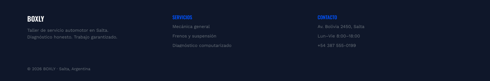

# TP3 — Mockups UI/UX (Figma)

**Alumno:** Chocobar Antonio  
**Marca:** BOXLY — taller de servicio mecánico automotor (Salta)  
**Basado en:** wireframe del TP anterior (`wireframe-figma-taller.png`)

## Enlace a Figma

https://www.figma.com/design/1MKE3Skw1MhIkSsq2L2091/Taller-Mecanico-Mockups-UI-UX-TP3

## Pantallas (12 + portada)

### 00 — Portada TP3

### 01 — Home

### 02 — Nosotros

### 03 — Servicios

### 04 — Servicio Detalle

### 05 — Agendar Turno

### 06 — Presupuesto

### 07 — Testimonios

### 08 — Galería

### 09 — Contacto

### 10 — Promociones

### 11 — FAQ

### 12 — Equipo

## Componentes

### Nav / Header

### Nav / Footer

### Button / Primary

### Button / Ghost

## Marca / UI

- **Tipografías:** Oswald (títulos) + Work Sans (cuerpo)
- **Colores:**
  - Estructura / header-footer: `#0F172A`
  - Texto principal: `#1E293B`
  - Acento / CTA / marca: `#0052FF`
  - Secundario (titanio): `#6C757D`
  - Fondos: `#F8F9FA` · cards `#FFFFFF`
  - Éxito: `#10B981`
