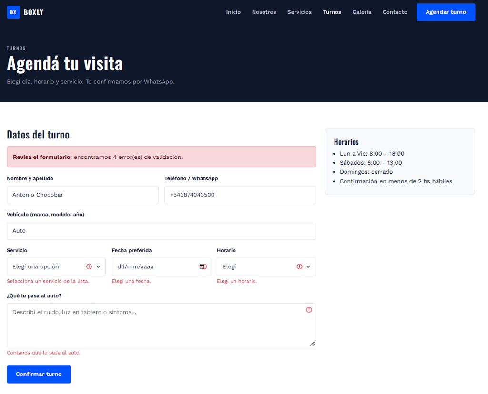
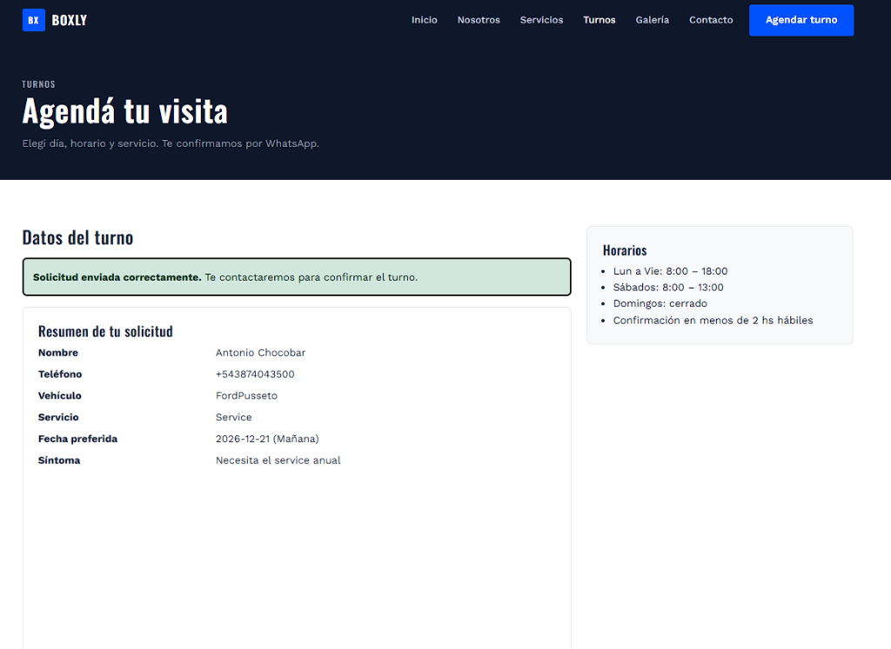
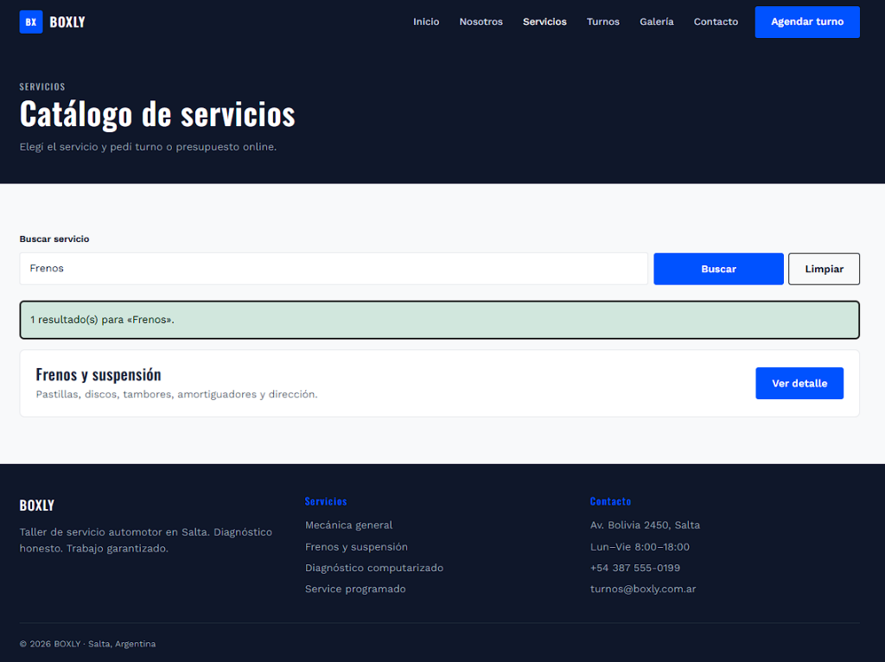
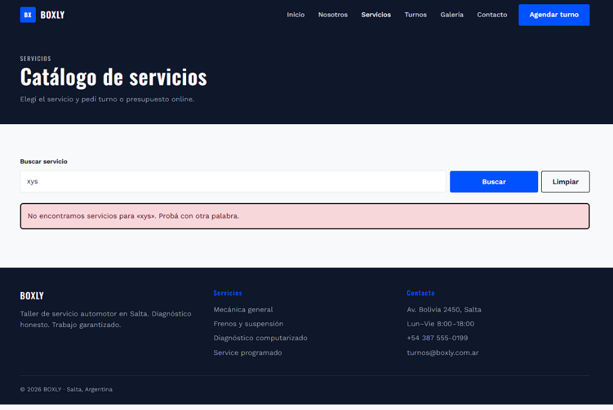
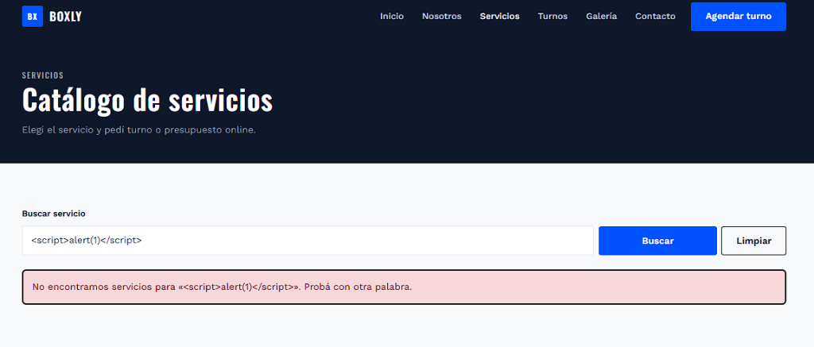

# BOXLY — Programación Web

Sitio del taller **BOXLY** (Salta): servicio mecánico automotor. Maquetación HTML5 + Bootstrap 5,
backend en PHP y persistencia en MySQL mediante PDO.

## Enlaces

- **Repositorio:** https://github.com/Antony27c/Programacion-Web
- **Mockups Figma:** https://www.figma.com/design/1MKE3Skw1MhIkSsq2L2091/Taller-Mecanico-Mockups-UI-UX-TP3
- **Versión estática (TP4) en GitHub Pages:** https://antony27c.github.io/Programacion-Web/entregas/tp4-html/

## Trabajos prácticos

Cada TP tiene su propio README con el objetivo según el enunciado, lo implementado, los archivos
principales, cómo probarlo y las pruebas realizadas. La columna *Rama* indica dónde quedó el trabajo
de cada TP: los iniciales (TP3 a TP5) en `main` y el resto en su rama `feature/tpN-...`; los README de
TP9 y TP10 se enlazan a sus ramas.

| TP   | Tema                                              | Rama                  | README |
|------|---------------------------------------------------|-----------------------|--------|
| TP3  | Diseño UX: wireframe y mockups en Figma           | `main`                | [`docs/tp3/README.md`](docs/tp3/README.md) |
| TP4  | Maquetación estática HTML5 + Bootstrap            | `main`                | [`entregas/tp4-html/README.md`](entregas/tp4-html/README.md) |
| TP5  | Formularios POST/GET y seguridad web              | `main`                | [`docs/tp5/README.md`](docs/tp5/README.md) |
| TP6  | Esquema relacional en MySQL                       | `feature/tp6-esquema` | [`docs/tp6/README.md`](docs/tp6/README.md) |
| TP7  | Persistencia PDO y CRUD de turnos                 | `feature/tp7-crud`    | [`docs/tp7/README.md`](docs/tp7/README.md) |
| TP8  | Sesiones, autenticación y roles                   | `feature/tp8-auth`    | [`docs/tp8/README.md`](docs/tp8/README.md) |
| TP9  | Comunicación asincrónica AJAX + JSON              | `feature/tp9-ajax`    | [`docs/tp9/README.md`](https://github.com/Antony27c/Programacion-Web/blob/feature/tp9-ajax/docs/tp9/README.md) |
| TP10 | Refactor MVC y módulo en Laravel                  | `feature/tp10-mvc`    | [`docs/tp10/README.md`](https://github.com/Antony27c/Programacion-Web/blob/feature/tp10-mvc/docs/tp10/README.md) · [`tp10-laravel/README.md`](https://github.com/Antony27c/Programacion-Web/blob/feature/tp10-mvc/tp10-laravel/README.md) |

- **TP3** — Wireframe y mockups UI/UX de las vistas del sitio en Figma (`docs/tp3/`).
- **TP4** — Maquetación estática de las 10 vistas en HTML5 + Bootstrap 5 con auditoría Lighthouse (`entregas/tp4-html/`).
- **TP5** — Sitio en PHP con estructura modular: formularios POST (turnos, contacto, presupuesto) y GET
  (buscador de servicios), con sanitización anti-XSS y validación en servidor.
- **TP6** — Modelo relacional del taller normalizado (1FN a 3FN): 8 tablas InnoDB con PK, FK, índices
  y auditoría; `tp6/schema.sql` + `tp6/consultas.sql` y el análisis en `tp6/NORMALIZACION.md`.
- **TP7** — Conexión PDO segura con `try/catch` y CRUD de turnos integrado al sitio (`admin/`),
  con consultas preparadas, transacciones y protección CSRF.
- **TP8** — Registro, login y logout con sesiones seguras (`HttpOnly`, `SameSite`, regeneración de id),
  `password_hash`/`password_verify` y control de acceso por roles (Administrador / Cliente).
- **TP9** — Endpoints JSON en `api/` consumidos con Fetch API: búsqueda de servicios en vivo,
  consulta pública del estado de un turno y cambio de estado desde el panel admin, todo sin recargar la página.
- **TP10** — Refactor del módulo de turnos a arquitectura MVC nativa en `app/` (Models, Controllers,
  Views con PHP puro) y módulo de catálogo de servicios en Laravel 12 dentro de `tp10-laravel/`.

## Estructura

```
├── config/
│   ├── conexion.php                 ← TP7: conexión PDO con try-catch
│   ├── conexion.local.example.php   ← plantilla de credenciales
│   └── conexion.local.php           ← credenciales reales (NO se versiona)
├── tp6/                             ← TP6: esquema relacional normalizado
│   ├── NORMALIZACION.md             ← tabla sin normalizar, 1FN, 2FN, 3FN, PK/FK y diagrama ER
│   ├── schema.sql                   ← DDL: base `boxly`, 8 tablas, FK, auditoría e índices
│   └── consultas.sql                ← DML: datos iniciales + SELECT/JOIN, UPDATE y DELETE
├── includes/
│   ├── header.php  footer.php       ← plantilla modular
│   ├── funciones.php                ← sanitización, validación de turnos, CSRF
│   ├── turnos_db.php                ← acceso a datos (catálogos, JOINs, alta/edición en transacción)
│   └── campos_turno.php             ← campos del formulario de turno (sitio y admin)
├── login.php registro.php logout.php mi-cuenta.php   ← TP8: autenticación
├── admin/                           ← TP7: CRUD de turnos (TP8: solo rol Administrador)
│   ├── index.php                    ← listado (Read) + filtro por estado
│   ├── crear.php                    ← alta (Create)
│   ├── editar.php                   ← modificación (Update)
│   ├── eliminar.php                 ← baja (Delete)
│   └── _formulario.php              ← formulario compartido alta/edición
├── index.php nosotros.php servicios.php servicio-detalle.php turnos.php
├── presupuesto.php testimonios.php galeria.php contacto.php faq.php
├── css/  js/  img/
├── entregas/
│   └── tp4-html/                    ← TP4: sitio estático HTML + auditoría Lighthouse
└── docs/
    ├── tp3/                         ← README, wireframe, informe TP3 y mockups Figma
    ├── tp5/                         ← README, cumplimiento y capturas (screenshots/) del TP5
    └── tp6/  tp7/  tp8/             ← README y cumplimiento de cada TP
```

## Tecnología

- HTML5 semántico, Bootstrap 5.3 (CDN), CSS propio (paleta BOXLY)
- PHP 8 con includes modulares
- MySQL 8 + PDO (consultas preparadas)
- Prettier

## Paleta

| Token | Hex | Uso |
|-------|-----|-----|
| Ink | `#0F172A` | Header, footer, hero |
| Texto | `#1E293B` | Tipografía principal |
| Acento | `#0052FF` | CTA, marca, links |
| Titanio | `#6C757D` | Texto secundario |
| Fondo | `#F8F9FA` | Superficies |
| Éxito | `#10B981` | Confirmaciones |

## Cómo correrlo en local

1. **Base de datos:** en MySQL Workbench / phpMyAdmin ejecutar, en este orden,
   `tp6/schema.sql` (crea la base `boxly` y sus tablas) y `tp6/consultas.sql` (carga catálogos,
   clientes, vehículos y turnos de ejemplo y corre las pruebas CRUD).
2. **Credenciales:** completar la contraseña de MySQL en `config/conexion.local.php`
   (si no existe, copiar `config/conexion.local.example.php` con ese nombre).
3. **Servidor:**

   ```bash
   # Servidor embebido de PHP (o copiar el proyecto a htdocs de XAMPP)
   php -S localhost:8099
   ```

4. Abrir http://localhost:8099 (sitio) y http://localhost:8099/admin/ (panel de turnos).

---

## TP6 — Diseño y creación del esquema relacional en MySQL

Desarrollo completo en [`tp6/NORMALIZACION.md`](tp6/NORMALIZACION.md).

- **Parte 1 — Normalización:** se parte de una planilla de turnos con servicios y precios en
  una sola celda y datos de cliente/vehículo repetidos, y se lleva a 1FN, 2FN y 3FN.
- **Parte 2 — [`tp6/schema.sql`](tp6/schema.sql):** 8 tablas InnoDB con PK `AUTO_INCREMENT`,
  FK con `ON DELETE RESTRICT/CASCADE`, `UNIQUE`, `CHECK`, auditoría `created_at`/`updated_at`
  e índices explícitos (`CREATE INDEX`) sobre `turnos(fecha)`, `turnos(estado_id, fecha)` y
  `usuarios(apellido, nombre)`.
- **Parte 3 — [`tp6/consultas.sql`](tp6/consultas.sql):** `INSERT` en maestras y tabla
  principal, `SELECT` con `WHERE` + `ORDER BY`, `INNER JOIN` de 5 tablas, `UPDATE` y `DELETE`
  con `WHERE`.

| Tipo | Tablas |
|------|--------|
| Usuarios | `usuarios` (email, password_hash, rol, datos personales) |
| Maestras | `roles`, `estados_turno`, `marcas`, `servicios` |
| Negocio | `vehiculos`, `turnos` |
| Relación N:M | `turno_servicio` (servicios de cada turno con su precio) |

---

## TP8 — Manejo de estado, sesiones y autenticación

Usuarios sobre la tabla `usuarios` del TP6 (`email` UNIQUE, `password_hash` VARCHAR(255), rol por FK a
`roles`: *Administrador* / *Cliente*, `created_at`). Admin de prueba: `admin@boxly.com.ar` / `Boxly2026!`.

| Archivo | Función |
|---------|---------|
| `registro.php` | Alta de cliente: sanitización (`trim` + `htmlspecialchars` en la salida), validación en servidor, email no repetido y `password_hash($password, PASSWORD_BCRYPT)` con consulta preparada. |
| `login.php` | `password_verify()` contra el hash; si es correcto `session_regenerate_id(true)` (anti Session Fixation) y guarda `$_SESSION['usuario_id']`, `['usuario_nombre']` y `['rol']`. Admin → `admin/`, cliente → `mi-cuenta.php`. Mensaje de error genérico. |
| `includes/auth_guard.php` | Guardián reutilizable: sin `$_SESSION['usuario_id']` redirige a `login.php?error=acceso_denegado`; con `$rolesPermitidos` restringe por rol. |
| `logout.php` | `$_SESSION = []`, borra la cookie de sesión, `session_destroy()` y redirige al login. Solo por POST con token CSRF. |
| `includes/sesion.php` | Cookie de sesión `HttpOnly`, `SameSite=Lax`, `Secure` bajo HTTPS, `use_strict_mode` y expiración por 30 min de inactividad. |

**Vistas protegidas:** `mi-cuenta.php` (cualquier usuario logueado: sus datos y sus turnos) y todo
`admin/` (solo rol *Administrador*; un cliente es redirigido con aviso de falta de permisos). Con sesión
iniciada, `turnos.php` precarga los datos y registra el turno a nombre de la cuenta.

---

## TP7 — Persistencia y conexión PHP-MySQL segura

Entidad gestionada: **`turnos`** del taller. Trabaja sobre el esquema normalizado del TP6:
cada turno referencia a un cliente (`usuarios`), un vehículo (`vehiculos`), un estado
(`estados_turno`) y uno o más servicios (`turno_servicio`). El flujo completo queda integrado al sitio:

- El cliente pide un turno desde **`turnos.php`** → se valida en servidor y se guarda en MySQL.
- El taller lo gestiona desde **`admin/`**: lo lista, filtra por estado, edita (p. ej. pasa de
  *Pendiente* a *Confirmado*) o elimina.

### Seguridad aplicada

| Requisito | Implementación |
|-----------|----------------|
| Conexión segura | `config/conexion.php`: PDO con `ERRMODE_EXCEPTION`, `FETCH_ASSOC`, `EMULATE_PREPARES = false` y `try/catch (PDOException)`. El detalle del error va a `error_log`, no al navegador. Credenciales fuera del repo. |
| SQL Injection | **Todas** las consultas (`SELECT`, `INSERT`, `UPDATE`, `DELETE`) usan `prepare()` + `execute()` con parámetros (`includes/turnos_db.php`). Los `id` se validan con `FILTER_VALIDATE_INT`. |
| XSS | Toda variable impresa pasa por `e()` → `htmlspecialchars(..., ENT_QUOTES, 'UTF-8')`. |
| Validación | `validarTurno()` en servidor: obligatorios, largo, email, regex de teléfono y patente, año, fecha válida, UTF-8 válido y listas blancas: marca, servicios y estado se validan contra los catálogos de la base. |
| Integridad | Alta y edición corren en una **transacción** (usuario → vehículo → turno → servicios): si algo falla se hace `rollBack()`. Desde el sitio público un email o patente existentes se reutilizan sin modificar sus datos. |
| CSRF | Alta, edición y baja exigen un token de sesión (`csrfToken()` / `csrfValido()`). La baja solo acepta `POST`: un link GET no puede borrar registros. |

### Modelo de datos

Ver el esquema completo y el diagrama ER en [`tp6/NORMALIZACION.md`](tp6/NORMALIZACION.md).

---

## TP5 — Procesamiento de formularios y seguridad web (PHP)

El sitio completo en **PHP** con estructura modular (`includes/header.php`, `includes/footer.php`,
`includes/funciones.php`) y lógica de servidor para capturar y procesar datos del navegador.

### Formulario POST — Solicitud de turno (`turnos.php`)

- Sanitización de `$_POST` con `trim()` + `htmlspecialchars()` (helpers `limpiar()` y `e()`) → previene **XSS**.
- Validación en servidor: obligatorios, teléfono con regex, fecha válida y no pasada, listas
  blancas y **formato de email** con `filter_var(..., FILTER_VALIDATE_EMAIL)` en `contacto.php` y `presupuesto.php`.
- Retroalimentación con `alert-success` / `alert-danger` + `is-invalid` / `invalid-feedback` por campo.
- Persistencia de los valores cargados (escapados) ante errores.

### Formulario GET — Buscador de servicios (`servicios.php?q=`)

Filtra el catálogo en servidor con `filter_input(INPUT_GET, ...)` y `mb_stripos()`; todo resultado
se imprime escapado.

### Capturas

**POST — Errores de validación y persistencia de campos**



**POST — Envío exitoso con resumen de datos procesados**



**GET — Buscador con resultados filtrados** (`servicios.php?q=Frenos`)



**GET — Búsqueda sin coincidencias** (`servicios.php?q=xys`)



**XSS neutralizado** — el `<script>` se imprime como texto, no se ejecuta



---

## TP3 / TP4 — Mockups y maquetación

- Mockups UI/UX en Figma: [`docs/tp3/mockups/`](docs/tp3/mockups/) · wireframe: [`docs/tp3/wireframe-figma-taller.png`](docs/tp3/wireframe-figma-taller.png)
- Maquetación estática de las 10 vistas (HTML + Bootstrap): [`entregas/tp4-html/`](entregas/tp4-html/) · auditoría: [`auditoria-lighthouse.md`](entregas/tp4-html/auditoria-lighthouse.md)

## Alumno

Chocobar Antonio  
Tecnicatura Superior en Análisis de Sistemas y Desarrollo de Software — IES N° 6001
